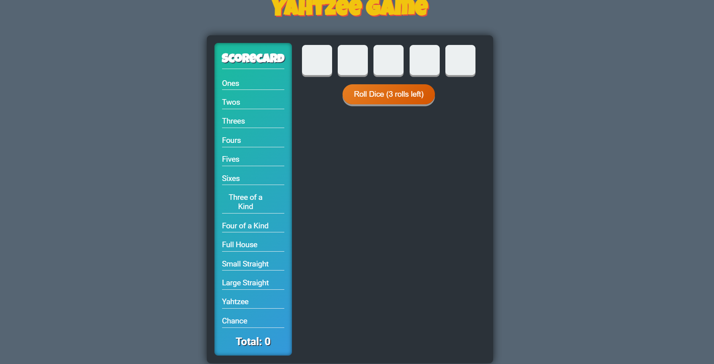

# Yahtzee Game

This project is a web-based implementation of the classic Yahtzee game, built with HTML, CSS, and JavaScript. The game provides an interactive user interface that allows players to roll dice, hold specific dice between rolls, and score points according to traditional Yahtzee rules.



## Features
- **Interactive Scorecard**: Displays categories like "Ones," "Twos," "Full House," and "Yahtzee."
- **Dice Roll and Hold**: Players can roll up to three times per turn and hold dice to strategize for higher scores.
- **Real-Time Scoring**: Automatically calculates scores based on dice values and selected categories.
- **End Turn Functionality**: Resets dice for a fresh start after each turn.

## How to Play
1. Click "Roll Dice" to roll all five dice.
2. Click on any dice to "hold" it, preventing it from rolling in subsequent rolls.
3. Roll up to three times per turn, then select a score category to apply your current roll's score.
4. The game continues until all score categories are filled.

## Installation
Clone this repository to try the game locally:
```bash
git clone https://github.com/mahad2111/yatzy
